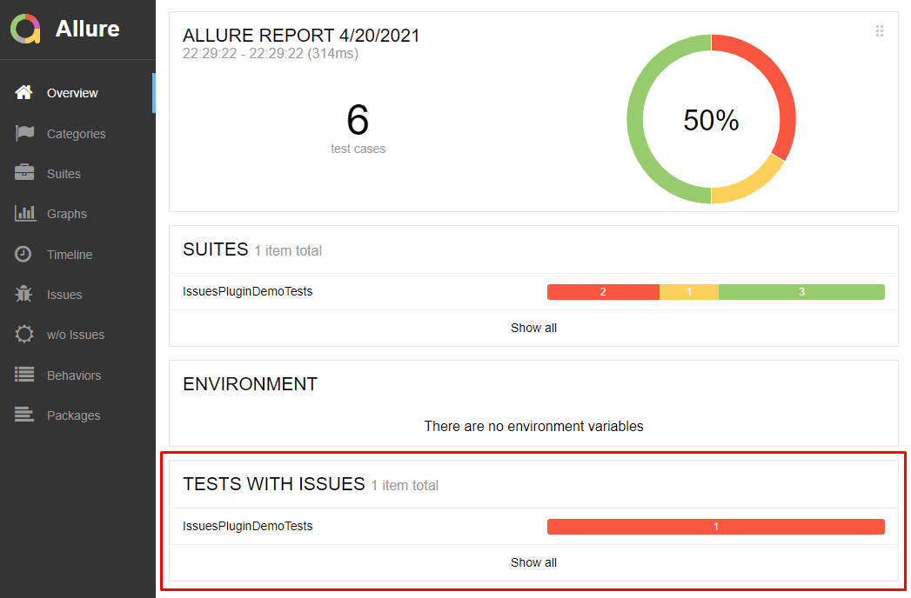

## ALLURE ISSUES PLUGIN

The plugin adds a new tab and a widget with issues tests to [Allure report](https://docs.qameta.io/allure/).

*Based on suites plugin.

### Installation

#### I. Clone the project

`git clone git@github.com:stykalin/allure-issues-plugin.git`

This project provides 2 ways of installation:

1. Manual installation
    * Execute gradle task: `gradle zipPlugin`
    * Unpack _allure-issues-plugin/build/plugin/issues-plugin.zip_
      to _<your_allure_folder>/plugins/issues-plugin_,
    * add string _- issues-plugin_ to _<your_allure_folder>/config/allure.yml_, according official documentation.

2. Auto installation
    * Execute gradle task: `gradle addToAllure -Pdir="<path_to_your_allure_folder>"`  
      Where _<path_to_your_allure_folder>_ could be like `D:\allure-2.13.8` or `/opt/allure-2.13.8`