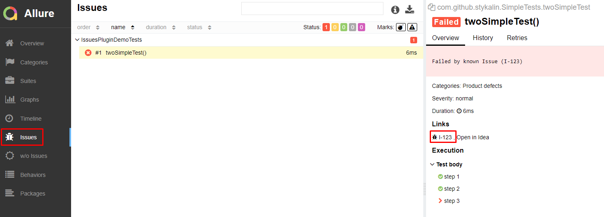

## ALLURE ISSUES PLUGIN

If you want in your [Allure report](https://docs.qameta.io/allure/) to find out which of your tests have annotation "@Issue" and which of the failed or broken tests don't,
this plugin adds 2 tabs - _Issues_ and _w/o Issues_ and 1 widget for _Issues_ to show it.

*[_Based on suites plugin._](https://github.com/allure-framework/allure2/blob/c85ea2b8e3992c9eac9f66c35f7914ad1bf9e03b/allure-generator/src/main/java/io/qameta/allure/suites/SuitesPlugin.java)

### Installation

This project provides 3 ways of installation:

1. Manual installation from source
    * Clone the project `git clone git@github.com:stykalin/allure-issues-plugin.git`
    * Execute gradle task: `gradlew zipPlugin`
    * Unpack _allure-issues-plugin/build/plugin/issues-plugin.zip_
      to _<your_allure_folder>/plugins/issues-plugin_,
    * Add string _- issues-plugin_ to _<your_allure_folder>/config/allure.yml_,
      according to [official documentation](https://docs.qameta.io/allure/#_step_8_enabling_a_plugin).

2. Auto installation from source
    * Clone the project `git clone git@github.com:stykalin/allure-issues-plugin.git`
    * Execute gradle task: `gradlew addToAllure -Pdir="<path_to_your_allure_folder>"`  
      Where _<path_to_your_allure_folder>_ could be like `D:\allure-2.13.8` or `/opt/allure-2.13.8`

3. Manual installation from releases
    * Download the latest version of plugin from [releases page](https://github.com/stykalin/allure-issues-plugin/releases)
    * Unpack it to _<your_allure_folder>/plugins/issues-plugin_,
    * Add string _- issues-plugin_ to _<your_allure_folder>/config/allure.yml_,
      according to [official documentation](https://docs.qameta.io/allure/#_step_8_enabling_a_plugin).